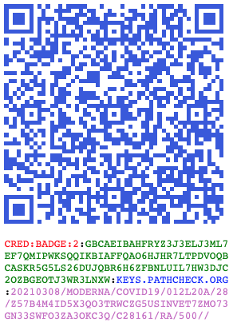

# Paper-first Verifiable Credentials URI Specification


**© 2021 PathCheck Foundation**<br/>
Authors: [Justin Dossey](mailto:justin.dossey@pathcheck.org) and [Vitor Pamplona](vitor.pamplona@pathcheck.org)<br/>
Status: *DRAFT*<br/>
Date: Feb 26, 2021<br/>

# Purpose

This document describes the protocol to compress Verifiable Credentials into URIs for space-limited alphanumeric-required applications, such as QR Codes, NFC tags and SMS Messages.

## Terms and Definitions

For the purposes of brevity, this document refers to the following terms which are defined as follows:
1. **HOLDER**: The **HOLDER** is the party who is receiving the credential from the **ISSUER**
1. **ISSUER**: The **ISSUER** is the party who delivers the credential to a **HOLDER**.
1. **VERIFIER**: The **VERIFIER** is the party who reads and verifies the signature of credential.

# General Structure

All verifiable credentials follow a URI Schema that starts with `CRED:` and a message with: 

1. the **type** of the payload, one of the options [here](https://github.com/Path-Check/paper-cred/tree/main/payloads)
1. the **version** of the payload
1. the **payload** itself
1. the **keyId**, a reference to the public key
1. and a cryptographic **signature** of the payload

The URI is simply organized in a colon-separated string as:
```
cred:type:version:signature:keyId:payload
```

The **type** field declares the [payload](payloads) type (e.g. `COUPON`, `PASSKEY`, `BADGE` or `STATUS`) and the **version** is a ever-incrementing **NUMERIC** field defining the version of the type of certificate. The **payload** block contains the information itself in a pre-defined format. The cryptographic signature is a DER signature in Base32 form, calculated using the private key of the **ISSUER**. 

## Payloads

Payload specifications define the syntax and semantic meaning of the fields as well as their order in the serialization process. All payload type specifications must be submitted as pull requests to the [payload](payloads) folder in this repository. The general payload encoding is described in sections below. 

## Example

The example below is a valid credential
```
CRED:COUPON:1:GBDAEIIA42QDQ5BDUUXVMSQ4VIMMA7RETIZSXB573OL24M4L67LYB24CZYVQEIIA2EZ5W2QXLR7LUSLQW
6MLAFV3N7OTT3BDAZCNCRMYBMUYC6WMXMNQ:KEYS.PATHCHECK.ORG:1/5000/SOMERVILLE%20MA%20US/1A/%3E65
```

# Benefits and Limitations

Main Benefits of this protocol are

1. Extremely small QR Sizes in Alphanumeric (~140 bytes for the average payload)
    1. Data minimalism by requirements of the application
    1. Allows for the use of feature phones and low energy chips as scanners. 
    1. It is ideal size and character set to use on SMS, SmartCards and NFC tags
    1. It's readable by any text file
1. Freedom of payload specification
    1. Any new payload can be described and approved in minutes
    1. Business logic is part of the payload definition as opposed to hidden
1. Freedom of cryptographic tools to sign for the packages. 
    1. RSA, ECDSA, JWTs and other signature models are supported
    1. Protocol guarantees easily accessible Public Keys by design
    1. Public Key files describe the algorithms being used by the issuer
1. Composability of QRs enable privacy and selective disclosure
    1. The hash of one QR can be used in another, building a signed chain of QRs
1. Domain-based trust model
    1. If users trust `cdc.gov`, they will also trust `keys.cdc.gov` 
    1. There is no need for a centralized issuing authority
    1. No need to trust app developers or private lists of approved issuers
1. Enhanced Security
    1. The signed payload is cryptographically protected and thus impossible to tamper
1. Freedom of binding
    1. There's no requirement to bind certificate to a user or proxy models to a user
    1. Electronic binding with individual wallets is possible when the certificate is loaded on an app. 
1. Extremely private  
    1. The only information online is a public key.
    1. The protocol does not require centralized servers. 
    1. No exposure to government, no blockchain, no private companies, no trusted lists
    1. There's no need to manage did's or other private issuing systems
1. Easy to backup 
    1. A simple picture or a paper copy serves as a backup of the code
1. Negligible cost per user on all activities
1. Generalizable: 
    1. Any record/payload can be created and signed in the same format
1. Free as in beer
    1. The entire specification is licensed under MIT License

Disadvantages are: 
1. Traceability of the QR Codes is possible by colluding verifiers
    1. Solutions include generating multiple salted QR Codes to be given away as opposed to one code that is read everywhere
1. Chance of losing the QR, losing the data
    1. The issuer might have a copy of the event record, but it is not a requirement
    1. Apps and pictures of the card can serve as a backup
1. No Real Time Revocation of cards/credentials 
    1. Issuer removes the public key from the domain, invalidating all certificates
    1. The verifier app needs to wait for the next issuer list (or revocation list) update
1. The information in the QR itself is not encrypted by design
    1. Payload specifications can include password-protected fields

# Signing and Hashing

Data to be used for signing and hashes is **uppercased**, **percent encoded** and then serialized with a slash-separated (`/`) string in the specified order the payload spec describes. Cryptographic signatures and hashes **MUST** be calculated against encoded versions of the underlying payload, as they appear in the final URI. This permits signature verification before any decoding. 

Cryptographic tools must sign and verify a SHA256 hash of the UTF-8 byte array of the **uppercased**, **percent-encoded**, slash-separated payload. The resulting signature in Distinguished Encoding Rules (DER - as per ASN.1 encoding rules defined in the [ITU-T X.690, 2002, specification](https://itu.int/itu-t/recommendations/rec.aspx?rec=X.690)) format must be then encoded in Base32URL, a Base32 ([RFC4648](https://tools.ietf.org/html/rfc4648)) without added padding (`=`). The removal of the padding is due to the fact that `=` is not a supported character on both URI and alphanumeric QR codes. 

# Public Key Download and Verifing

Public Keys can be generated using any cryptographic method. Verifiers must implement the cryptographic protocol included in the Public Key PEM File. Any verifier must be able to download a public key of the signer and maintain an indexed local key-value store of approved public keys in PEM format. 

The keyID of the public key can be: 
1. a FQDN to a DNS TXT Record containing the key for download.
1. a database and key ID to facilitate trusted lists of issuers.
1. a URL address to download keys from. 

Before validating a signature, verifiers must compute the SHA256 of the payload (as is from the URI) and decode the Base32URL signature. 

## 1. DNS TXT Record

When the key is placed into DNS TXT records, issuers need to convert their PEM files to remove: 
1. -----BEGIN PUBLIC KEY-----
1. -----END PUBLIC KEY-----
2. new line chars or `\n`, as new line is not a valid character for TXT Records. 

Issuers should replace `\n` with `\\n`. Verifiers must convert back from `\\n` to `\n`

Make sure the remaining PEM includes an Object Identifier (OID) in the base64 format. 

For example, the keyId `keys.pathcheck.org` needs a DNS Lookup and has: (`$ dig -t txt keys.pathcheck.org`):
```
MFYwEAYHKoZIzj0CAQYFK4EEAAoDQgAE6DeIun4EgMBLUmbtjQw7DilMJ82YIvOR\\n2jz/IK0R/F7/zXY1z+gqvFXfDcJqR5clbAYlO9lHmvb4lsPLZHjugQ==
```

Verifiers must then return the content to it's original format by replacing `\\n` by the new line character. 

## 2. Trusted List of Issuers

If the public key comes from a fixed database of keys (trusted lists of keys), the period character (`.`) is used as a delimiter to separate the key-value store identifier and the key identifier in the order of specific to broad. 

As an example, the keyId `1a9.cdc` means the database is coming from the CDC and the id in that database is `1a9`. Each ID must contain the raw PEM file of the issuer. 

## 3. Downloadable PEM file

This keyId is a direct URL reference with the raw PEM file of the public key inside the issuer's website, but without the URL Schema component (`https://`). Host must result the link in **uppercase** format. Verifiers must add `https://` to the URL, download and parse the key.  

For example, the keyId ```www.pathcheck.org/hubfs/pub``` downloads a file that contains the public key of a ECDSA keypair. 

# Payload Encodings

The payload should be represented as a series of **uppercased**, **percent-encoded** values delimited by the slash (`/`) character. The serialization order is defined in each type of payload specification and key names are omitted. Percent encoding of the upcased payload is used to address QR code character set limitations, while supporting the URI spec. 

## Global Data Types

This document will use the following terms to define data types.
1. **NUMERIC**: The **NUMERIC** data type is a sequence of integers between 0 and 99999999, inclusive.
2. **STRING**: The **STRING** data type is a sequence of UTF-8, [NFC Normalized](https://www.unicode.org/faq/normalization.html) characters, up to 255 bytes after encoding.
3. **HASH**: The **HASH** data type is a sequence of 52 alphanumeric characters containing a base32-encoded hash.
3. **SIGNATUREBASE32**: The **SIGNATUREBASE32** data type is a sequence of up-to-102 alphanumeric characters containing a base32url-encoded digest.
4. **DATE**: a date, in [ISO 8601 (YYYYMMDD) Basic Notation](https://en.wikipedia.org/wiki/ISO_8601). Example: `20200201` is 1 February, 2020.
5. **SHORTSTRING**: a sequence of US-ASCII characters which is limited to 8 bytes in length.
6. **SHORTNUMERIC**: a **NUMERIC** with a maximum value of 9.
7. **PHONE**: a E.164 formatted phone number as string. US-ASCII, maximum 15 characters.

## Percent Encoding

Payload Values are encoded per the standard using [Percent Encoding](https://en.wikipedia.org/wiki/Percent-encoding). Note that all characters not present in the Alphanumeric QR scheme must be percent encoded. The Alphanumeric QR Code type imposes significant limitations on the data which can be represented, but allows for the generation of a lower-resolution QR code. Smaller QR codes will be scannable with older hardware and lower-resolution scanners, and smaller data sets allow for more aggressive error correction. This promotes usability and equity.

## Case Insensitivity

All fields (keys as well as values) are case-insensitive in both JSON and URI format. When performing operations such as hash comparison, a case-insensitive comparison function MUST be used. Additionally, the Alphanumeric QR Code character set does not include lowercase characters, so implementations MUST encode output in uppercase only.

For clarity and ease of reading, examples in this document are given in mixed case. 

## Optional Fields

Unfilled fields MUST be submitted as empty between slash (`/`) characters. Only add empty delimiters if there is data after. Given fields A (required), B (optional), C (optional) the implementation MUST follow the following example:

| A | B | C | Output        |
|-----|-----|-----|---------|
| `1` |     |     | `1`     |
| `1` | `2` |     | `1/2`   |
| `1` | `2` | `3` | `1/2/3` |
| `1` |     | `3` | `1//3`  |

## Additional Percent Encoding for the  Alphanumeric QR character set

All characters not present in the Alphanumeric QR scheme must be percent
encoded when presented in data fields. RFC 2936 requires percent encoding a
number of characters, but some of the characters not required to be encoded are
not included in the Alphanumeric QR character set. As a result, those characters
MUST also be percent encoded. 

<details>
  <summary>Show me which characters need encoding</summary>

### Which Characters Need Encoding?

The columns in the table below indicate encoding requirements for each
representable character. Any non-listed characters MUST be percent-encoded. The
"URI Requires" column indicates whether the URI format rules (RFC 2396) requires encoding the character.
The "Alphanumeric QR Requires" column indicates whether the character is missing from the
Alphanumeric QR character set (thus, requiring encoding). The "Must Encode?" column indicates whether this
specification requires percent-encoding of the character. The "Output Value"
column indicates the expected output from processing the listed character.

| Character | URI Requires | Alphanumeric QR Requires | Must Encode? | Output Value |
| --------- | -------- | --------------- | ---- | ------------ |
| ` ` | YES | NO  | YES | `%20` |
| `!` | YES | YES | YES | `%21` |
| `"` | YES | YES | YES | `%22` |
| `#` | YES | YES | YES | `%23` |
| `$` | YES | NO  | YES | `%24` |
| `%` | YES | NO  | YES | `%25` |
| `&` | YES | YES | YES | `%26` |
| `'` | YES | YES | YES | `%27` |
| `(` | YES | YES | YES | `%28` |
| `)` | YES | YES | YES | `%29` |
| `*` | YES | NO  | YES | `%2A` |
| `+` | YES | NO  | YES | `%2B` |
| `,` | YES | YES | YES | `%2C` |
| `-` | YES | NO  | YES | `%2D` |
| `.` | YES | NO  | YES | `%2E` |
| `/` | YES | NO  | YES | `%2F` |
| `0` | NO  | NO  | NO  | `0`   |
| `1` | NO  | NO  | NO  | `1`   |
| `2` | NO  | NO  | NO  | `2`   |
| `3` | NO  | NO  | NO  | `3`   |
| `4` | NO  | NO  | NO  | `4`   |
| `5` | NO  | NO  | NO  | `5`   |
| `6` | NO  | NO  | NO  | `6`   |
| `7` | NO  | NO  | NO  | `7`   |
| `8` | NO  | NO  | NO  | `8`   |
| `9` | NO  | NO  | NO  | `9`   |
| `:` | YES | NO  | YES | `%3A` |
| `;` | YES | YES | YES | `%3B` |
| `<` | YES | YES | YES | `%3C` |
| `=` | YES | YES | YES | `%3D` |
| `>` | YES | YES | YES | `%3E` |
| `?` | YES | YES | YES | `%3F` |
| `@` | YES | YES | YES | `%40` |
| `A` | NO  | NO  | NO  | `A`   |
| `B` | NO  | NO  | NO  | `B`   |
| `C` | NO  | NO  | NO  | `C`   |
| `D` | NO  | NO  | NO  | `D`   |
| `E` | NO  | NO  | NO  | `E`   |
| `F` | NO  | NO  | NO  | `F`   |
| `G` | NO  | NO  | NO  | `G`   |
| `H` | NO  | NO  | NO  | `H`   |
| `I` | NO  | NO  | NO  | `I`   |
| `J` | NO  | NO  | NO  | `J`   |
| `K` | NO  | NO  | NO  | `K`   |
| `L` | NO  | NO  | NO  | `L`   |
| `M` | NO  | NO  | NO  | `M`   |
| `N` | NO  | NO  | NO  | `N`   |
| `O` | NO  | NO  | NO  | `O`   |
| `P` | NO  | NO  | NO  | `P`   |
| `Q` | NO  | NO  | NO  | `Q`   |
| `R` | NO  | NO  | NO  | `R`   |
| `S` | NO  | NO  | NO  | `S`   |
| `T` | NO  | NO  | NO  | `T`   |
| `U` | NO  | NO  | NO  | `U`   |
| `V` | NO  | NO  | NO  | `V`   |
| `W` | NO  | NO  | NO  | `W`   |
| `X` | NO  | NO  | NO  | `X`   |
| `Y` | NO  | NO  | NO  | `Y`   |
| `Z` | NO  | NO  | NO  | `Z`   |
| `[` | YES | YES | YES | `%5B` |
| `\` | YES | YES | YES | `%5C` |
| `]` | YES | YES | YES | `%5D` |
| `^` | YES | YES | YES | `%5E` |
| `_` | NO  | YES | YES | `%5F` |
| `{` | YES | YES | YES | `%7C` |
| `}` | YES | YES | YES | `%7D` |
| `~` | NO  | YES | YES | `%7E` |
</details>

# Implementation Guidance

## Pseudo-Code describing signing and assembling of the URI:

To sign and assemble URI:
```js
payload = [number, total, city, phase, indicator];
for ($i = 0; $i < length($payload); $i += 1) do
  $upcasedValue = upcase($payload[$i]);
  $encodedValue = percentEncode($payload[$i]);
  $payload[$i] = $encodedValue;
end

$payloadString = join('/', $payload);
$payloadHash = sha256($payloadString.to('utf-8'));

$keyId = $DNS_TXT_FQDN || $URL_TO_PEM_FILE || $REF_TO_DATABASE
$signatureDER = ecdsaSign($payloadHash);

$signature = b32toB32URL(b32encode($signatureDER))
$base = join(':', ["cred", $type, $version, $signature, $keyId]);
$upcasedBase = upcase($base);

$uri = $upcasedBase + ":" + $payloadString;
```

## Pseudo-Code describing parsing and verifying of the URI:

To parse and verify a URI:
```js
[$schema, $type, $version, $signature, $keyId, $payloadString] ::= qr.split(':')
$payload = $payloadString.split('/')

$publicKeyPem = localDB($keyId) || download($keyId)
$payloadHash = sha256($payloadString.to('utf-8')))
$signatureDER = b32decode(b32URLtoB32($signature))

$valid = ecdsaVerify($signatureDER, $payloadHash, $publicKeyPem)

for ($i = 0; $i < length($payload); $i += 1) do
  $payload[$i] = percentDecode($payload[$i]);  
end
```

## Pseudo-Code describing Base32 to Base32URL Mapping

To remove padding from Base32-encoded strings do: 
```js
$base32URL = $base32.replaceAll("=", "");
```

To add padding back to Base32-encoded strings do:
```js
switch ($base32URL.length % 8) {
    case 2: $base32 = $base32URL + "======"; break;
    case 4: $base32 = $base32URL + "====";  break;
    case 5: $base32 = $base32URL + "==="; break;
    case 7: $base32 = $base32URL + "="; break;
    default: $base32 = $base32URL;
}
```   
# OpenSource Demos and Snippet files. 

* [PathCheck Demo in JavaScript](https://vitorpamplona.com/vaccine-certificate-qrcode-generator/index.v5.html)
* [Signing and Verifier Snippet in Python](https://github.com/vitorpamplona/vaccine-certificate-qrcode-generator/blob/main/verify.py)
* [Signing and Verifier Snippet in Ruby](https://github.com/vitorpamplona/vaccine-certificate-qrcode-generator/blob/main/verify.rb)
* [Signing and Verifier Snippet in Java](https://github.com/vitorpamplona/vaccine-certificate-qrcode-generator/blob/main/verify.java)
* [Signing and Verifier Snippet in zSh Script](https://github.com/vitorpamplona/vaccine-certificate-qrcode-generator/blob/main/verify.sh)

# Contributing

[Issues](https://github.com/Path-Check/paper-cred/issues) and [pull requests](https://github.com/Path-Check/paper-cred/pulls) are very welcome! :)
